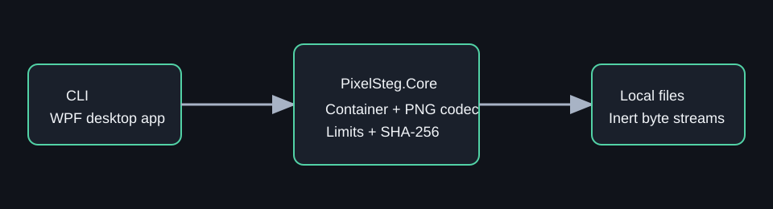
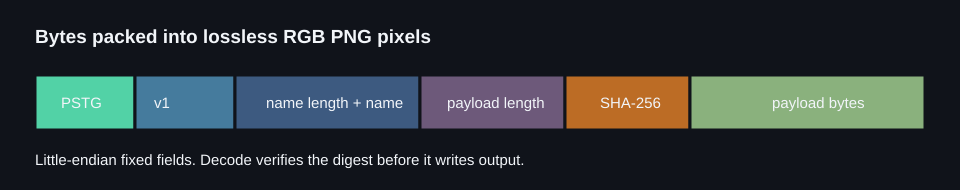

# PixelSteg

PixelSteg is a local .NET 8 tool for packaging a file in a lossless PNG and recovering the original bytes later. It can be useful when a PNG container fits a local file-transfer workflow. It is deliberately straightforward: encoding is **not encryption or steganographic secrecy**, and PixelSteg is not a downloader, loader, or execution mechanism.

## Project status

PixelSteg is an initial source release for .NET 8. Core, CLI, Windows WPF app,
format documentation, and bounded synthetic tests live in this repository.
There are no published binaries; build from source and verify the exact
revision and platform you intend to use.



## Safety model

- Decoding returns bytes and metadata only. It never opens, loads, executes, downloads, or interprets decoded content.
- The container enforces a 128 MiB payload ceiling, a filename limit, a format version, and a SHA-256 integrity digest.
- Before writing output, PixelSteg validates PNG chunks, dimensions, zlib data, byte count, and the container digest.
- Decoded names are reduced to a local filename, which keeps them inside the selected directory.
- CLI encoding refuses to replace an existing file. Decoding requires `--overwrite`, and the desktop app asks before replacing a file.

Extraction does not make an unknown file safe. Treat decoded bytes as you would any downloaded file: inspect and scan them before opening them.

## Format



The payload container begins with ASCII `PSTG`, followed by little-endian version `1`, a UTF-8 filename length and filename, an Int64 payload length, a 32-byte SHA-256 digest, and the payload. The full container is prefixed with its byte count, then packed three bytes at a time into 8-bit RGB pixels in a standard lossless PNG. PixelSteg deterministically produces filter-0 RGB PNG files and accepts only that small profile when decoding.

## CLI

From the repository root:

```powershell
dotnet run --project src/PixelSteg.Cli -- encode docs/images/synthetic-sample.txt $env:TEMP/pixelsteg-sample.png
New-Item -ItemType Directory -Force $env:TEMP/pixelsteg-decoded
dotnet run --project src/PixelSteg.Cli -- decode $env:TEMP/pixelsteg-sample.png $env:TEMP/pixelsteg-decoded
```

`encode <input> <output.png>` creates a new PNG and will not replace an existing output. `decode <input.png> <output-directory> [--overwrite]` validates the PNG and container before writing the verified result. Progress and errors go to stderr. Exit codes are 0 for success, 1 for a processing failure, 2 for a usage error, 3 when an overwrite is refused, and 4 for cancellation.

## Desktop app

On Windows, run:

```powershell
dotnet run --project src/PixelSteg.App
```

The WPF app offers Encode and Decode modes, Browse buttons, drag-and-drop input, destination selection, progress, cancellation, focusable controls, the original embedded filename, and a concise integrity status. It has no network feature and never launches decoded content.

## Build and test

```powershell
dotnet restore PixelSteg.sln
dotnet test PixelSteg.sln -c Release --no-restore
dotnet build PixelSteg.sln -c Release --no-restore
dotnet format PixelSteg.sln --verify-no-changes --no-restore
```

## Limits and threat model

PixelSteg is intended for ordinary local file transport when a PNG container is useful. It makes no confidentiality claim: RGB pixel data is reversible, and the digest detects accidental or deliberate changes but does not authenticate the file's creator. It supports RGB PNG containers generated by PixelSteg, with a maximum original payload of 128 MiB. Unsupported PNG styles are deliberately rejected instead of passing them to a broad image parser.

See [SECURITY.md](SECURITY.md), [CONTRIBUTING.md](CONTRIBUTING.md), and [release readiness](docs/release-readiness.md).

## License

PixelSteg is available under the [MIT License](LICENSE). The license covers
the source and documentation in this repository. Users remain responsible for
the rights and safety of files they encode or decode.
