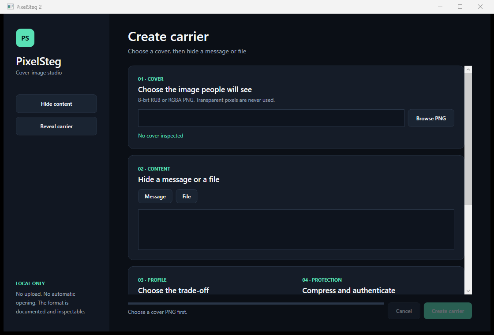

# PixelSteg

PixelSteg hides a message or a small collection of files inside the colour channels of an ordinary lossless PNG. The carrier still opens as an image; PixelSteg can inspect it, identify the embedding profile, and recover the original content later.

Everything runs locally. The desktop app is aimed at occasional use, while the CLI makes the same format practical in scripts and repeatable workflows.



## What it does

- hides UTF-8 messages or up to 64 files in an existing 8-bit RGB/RGBA PNG;
- reports the exact capacity before writing and measures MSE, PSNR and global SSIM afterwards;
- offers four profiles for different capacity and resilience trade-offs;
- optionally compresses the bundle with Brotli;
- optionally protects it with AES-256-GCM and a key derived with PBKDF2-SHA-256;
- detects PixelSteg carriers and their settings without needing the password;
- verifies every recovered entry with SHA-256 before it is written;
- never uploads, opens or executes recovered content.

The format is public and intentionally identifiable. PixelSteg does not claim to defeat steganalysis, survive social-media recompression, or make an untrusted file safe.

## Profiles

| Profile | Placement | Capacity | Intended use |
| --- | --- | ---: | --- |
| **Balanced** | One low bit per RGB channel, in image order | about 3 bits/pixel | Good default for clean lossless carriers |
| **Dense** | Two low bits per RGB channel | about 6 bits/pixel | More space, with a larger possible colour change |
| **Adaptive** | One low bit, textured 8x8 blocks first | about 3 bits/pixel | Places changes in visually busy areas before flat areas |
| **Resilient** | Adaptive placement plus Hamming(12,8) | about 2 bits/pixel | Corrects a single changed bit in each encoded byte |

Only fully opaque pixels are used, so hidden RGB values under transparent or translucent pixels cannot leak into a later image conversion. The fixed 70-byte locator uses another 560 channels and is included in the capacity shown by the app.

## Desktop app

PixelSteg has two deliberate workflows: **Hide content** and **Reveal carrier**. Choose a cover, add a message or a file, compare the profile capacities, and write a new PNG. Reveal mode inspects the carrier first and only asks for a password when the bundle is protected. The CLI can place several files in one carrier.

```powershell
dotnet run --project src/PixelSteg.App
```

The desktop app requires Windows and .NET 8. It will not overwrite an existing output without an explicit decision.

## CLI

Hide a message read from standard input:

```powershell
"Meet at 18:30" | dotnet run --project src/PixelSteg.Cli -- embed-message cover.png carrier.png --profile adaptive
```

Hide one or more files and read them back:

```powershell
dotnet run --project src/PixelSteg.Cli -- embed-file cover.png carrier.png notes.txt map.pdf --profile balanced
dotnet run --project src/PixelSteg.Cli -- inspect carrier.png
dotnet run --project src/PixelSteg.Cli -- extract carrier.png recovered
```

Passwords are never accepted as command-line values. Read them from standard input or a named environment variable so they do not appear in shell history or process listings:

```powershell
$env:PIXELSTEG_PASSWORD = Read-Host -MaskInput "Password"
dotnet run --project src/PixelSteg.Cli -- embed-file cover.png carrier.png notes.txt --password-env PIXELSTEG_PASSWORD
dotnet run --project src/PixelSteg.Cli -- extract carrier.png recovered --password-env PIXELSTEG_PASSWORD
Remove-Item Env:PIXELSTEG_PASSWORD
```

`read-message` prints message entries without creating files. `extract` refuses to replace an existing file unless `--overwrite` is present. The older `encode` and `decode` commands remain available for the simple version-1 generated-image container.

## Build and test

```powershell
dotnet restore PixelSteg.sln
dotnet build PixelSteg.sln -c Release --no-restore
dotnet test PixelSteg.sln -c Release --no-build
dotnet format PixelSteg.sln --verify-no-changes --no-restore
```

The core and CLI are cross-platform .NET 8 projects. The WPF app and its tests build on Windows. Runtime code uses only the .NET base class library; test packages do not ship with releases.

## Boundaries

- Use lossless PNG from input to output. Cropping, resizing, palette conversion, colour adjustment and JPEG/WebP recompression can destroy the embedded data.
- Password protection provides confidentiality and authentication for the bundle, not anonymity or proof of who created it.
- Resilient corrects isolated one-bit errors per codeword; it is not protection against general image editing.
- The reader accepts non-interlaced 8-bit true-colour PNG, with or without alpha, up to 32 million pixels. Bundles are limited to 64 entries and roughly 130 MiB before the carrier-capacity check.
- A carrier is still untrusted input. Inspect recovered files before opening them.

The complete byte layout and placement rules are in [Format v2](docs/format-v2.md). Security reporting is covered by [SECURITY.md](SECURITY.md), and contribution checks by [CONTRIBUTING.md](CONTRIBUTING.md).

## License

PixelSteg is available under the [MIT License](LICENSE).
